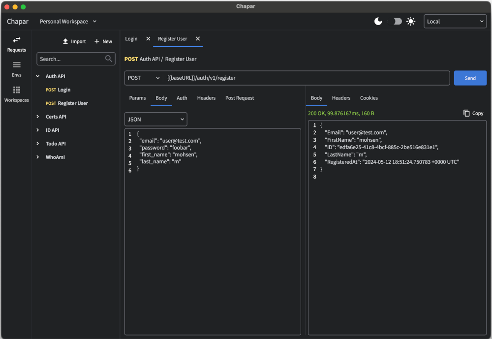
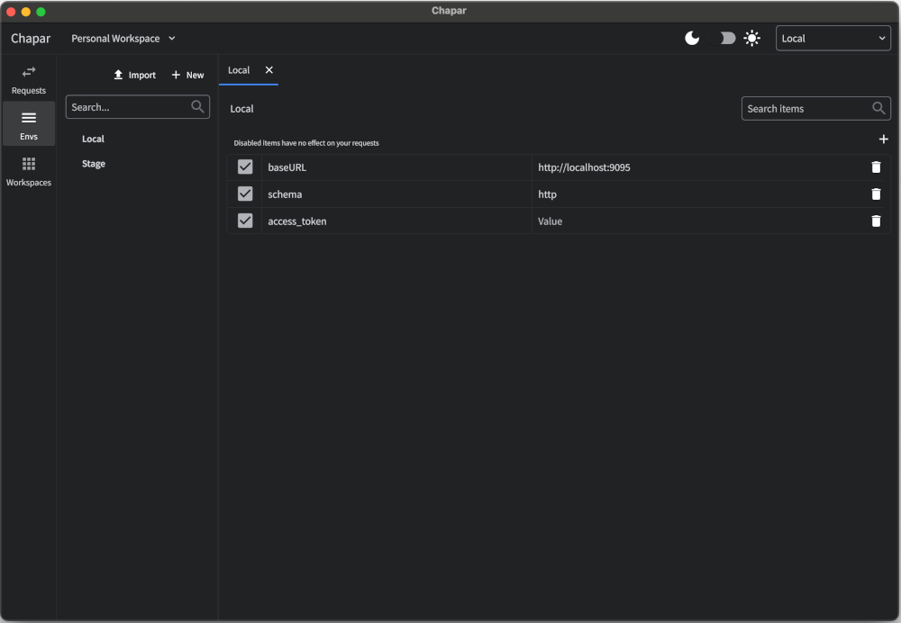
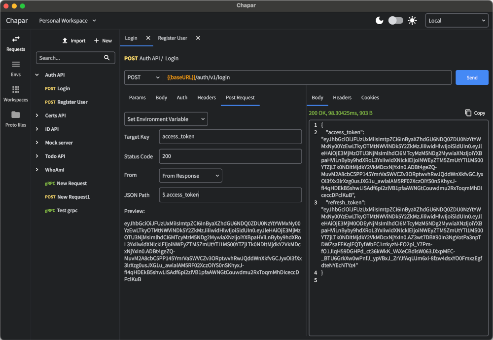
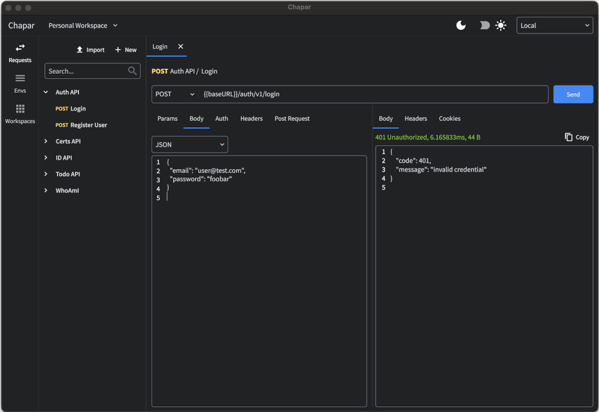

<div align="center">
  
</div>

# Chapar - Native API Testing Tool

Chapar is an upcoming native API testing tool built with GoLang, designed to simplify and expedite the testing process for developers. While still in its early beta phase, Chapar aims to offer a user-friendly experience with support for both HTTP and gRPC protocols with.

## What Chapar means?
Chapar was the institution of the royal mounted couriers in ancient Persia.
The messengers, called Chapar, alternated in stations a day's ride apart along the Royal Road.
The riders were exclusively in the service of the Great King and the network allowed for messages to be transported from Susa to Sardis (2699 km) in nine days; the journey took ninety days on foot.

Herodus described the Chapar as follows:

> There is nothing in the world that travels faster than these Persian couriers. Neither snow, nor rain, nor heat, nor darkness of night prevents these couriers from completing their designated stages with utmost speed.
>
> Herodotus, about 440 BC

## State of the project
Chapar is currently in the early beta phase, with the first release expected soon. The project is under active development, with regular updates and improvements planned to enhance the user experience and functionality.

## Screenshots
<div align="center">
  
  
  
  
  
  
</div>


### Key Features
* User-Friendly Interface: Chapar prioritizes ease of use, ensuring developers can quickly get started with testing their API endpoints.

* Protocol Flexibility: Test endpoints with ease, supporting both HTTP and gRPC protocols.
Fast-Paced Development: Expect regular updates and improvements as Chapar evolves to meet the needs of developers.

* Efficiency: Conduct tests efficiently without sacrificing accuracy or reliability.


### Getting Started
Stay tuned for the upcoming early beta release of Chapar. Once released, clone the repository or download the beta version to get started with testing your API endpoints.

```bash
  go mod tidy
  go mod vendor
  make run
```

### Contributing
We welcome contributions from the community once the early beta is released! If you have ideas, feedback, or wish to contribute, please open an issue or submit a pull request.

### Support
You can support the development of Chapar by starring the repository, sharing it with your friends, and contributing to the project. 
Also you can support the project by donating to the project's wallet.

[](https://www.buymeacoffee.com/mohsen.mirzakhani)
