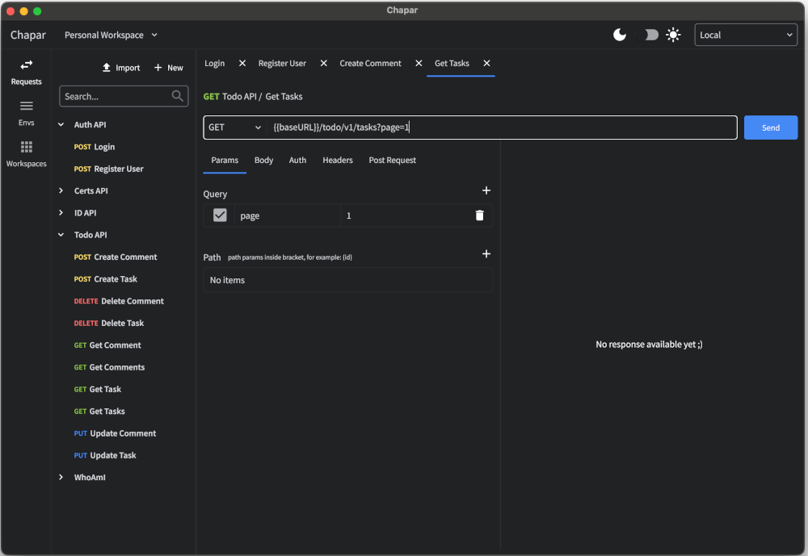
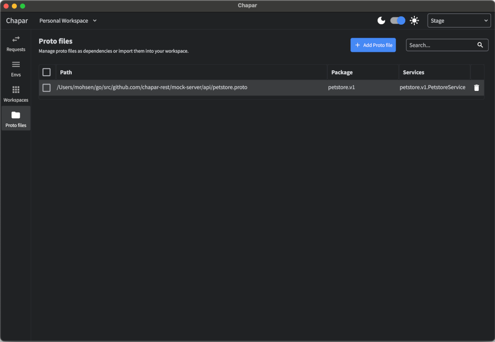
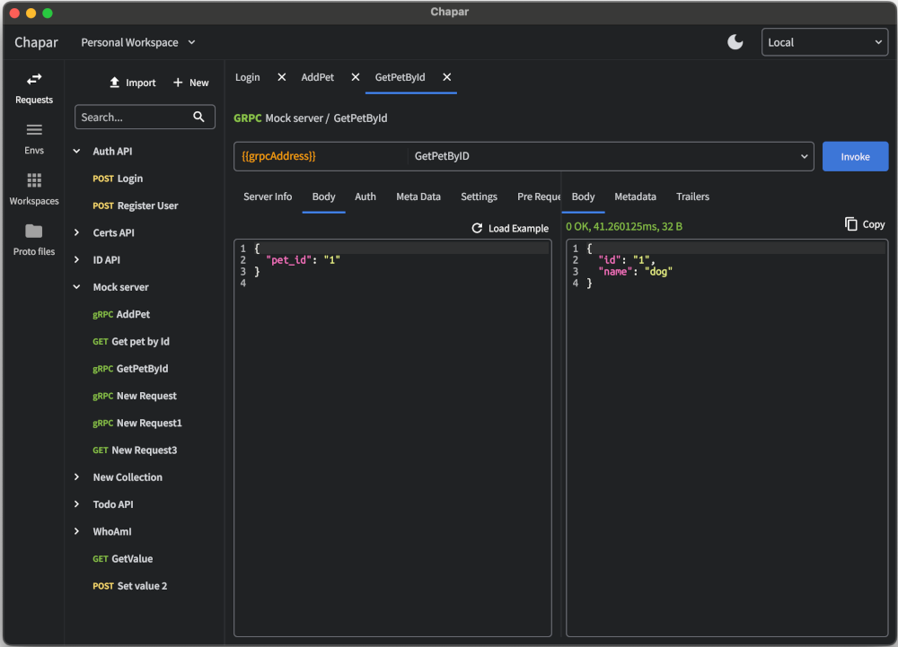

<div align="center">
  
  <br/>
  <br/>
  <a href="https://img.shields.io/github/v/release/chapar-rest/chapar?include_prereleases" title="Latest Release" rel="nofollow"></a>
  <a href='https://gophers.slack.com/messages/chapar'></a>
</div>

# Chapar - Native API Testing Tool

Chapar is an upcoming native API testing tool built with GoLang, designed to simplify and expedite the testing process for developers. While still in its early beta phase, Chapar aims to offer a user-friendly experience with support for both HTTP and gRPC protocols with.

## What Chapar means?
Chapar was the institution of the royal mounted couriers in ancient Persia.
The messengers, called Chapar, alternated in stations a day's ride apart along the Royal Road.
The riders were exclusively in the service of the Great King and the network allowed for messages to be transported from Susa to Sardis (2699 km) in nine days; the journey took ninety days on foot.

Herodus described the Chapar as follows:

> There is nothing in the world that travels faster than these Persian couriers. Neither snow, nor rain, nor heat, nor darkness of night prevents these couriers from completing their designated stages with utmost speed.
>
> Herodotus, about 440 BC

## State of the project
> GRPC support is added to the project. You can test your GRPC endpoints with Chapar. this change is not released yet. you can build the project from source to test it.
> 
Chapar is currently in the early beta phase, with the first release expected soon. The project is under active development, with regular updates and improvements planned to enhance the user experience and functionality.

## Screenshots
<div align="center">
  
  
  
  
  
  
  
  
  
</div>


### Features
* Create and manage workspaces to organize your API endpoints.
* Create and manage environments to store variables and configurations for your API endpoints.
* Create and manage requests to test your API endpoints.
* Send requests with different methods (GET, POST, PUT, DELETE, PATCH, HEAD, OPTION,CONNECT).
* Send requests with different content types (JSON, XML, Form, Text, HTML).
* Send requests with different authentication methods (Basic, Bearer, API Key, No Auth).
* Send requests with different body types (Form, Raw, Binary).
* Set environment variables from the response of the request using JSONPath.
* Dark mode support.
* Data is stored locally on your machine. and no data is sent to any server.
* Import collections and requests from Postman.
* Support GRPC protocol.
* Support for grpc reflection and proto files.
* Load sample request structure of given grpc method.

### Roadmap
* Support WebSocket, GraphQL protocol.
* Syntax highlighting for request body.
* Python as a scripting language for pre-request and post-request scripts.
* Support for tunneling to servers and kube clusters as pre request actions.


### Getting Started
Stay tuned for the upcoming early beta release of Chapar. Once released, clone the repository or download the beta version to get started with testing your API endpoints.


### Already using Chapar?
In case you are already using Chapar, you may need to fix the following issues in the data:
* The data is stored in the following path: please backup the data before running the fixer script.
  * Windows: `C:\Users\<username>\AppData\Roaming\chapar`
  * Linux: `/home/<username>/.config/chapar`
  * macOS: `/Users/<username>/.config/chapar`

You will need to run fixer script to fix the data:
```bash
    go run cmd/fixer/main.go fix-request-types
```

### Installation
#### Download the latest release
You can download the latest release from the [releases page](https://github.com/chapar-rest/chapar/releases).

#### Install From Source
To install Chapar from source, clone the repository install the dependencies, and run the application using the following commands:
```bash
git clone https://github.com/chapar-rest/chapar.git
cd chapar
go build -o chapar .
```

## Dependencies
If you want to build the project from source, you need to install the following dependencies:
Chapar is built using [Gio](https://gioui.org) library so you need to install the following dependencies to build the project:

for linux follow instructions in [gio linux](https://gioui.org/doc/install/linux)
for macOS follow instructions in [gio macos](https://gioui.org/doc/install/macos)


### Contributing
We welcome contributions from the community once the early beta is released! If you have ideas, feedback, or wish to contribute, please open an issue or submit a pull request.

### Support
You can support the development of Chapar by starring the repository, sharing it with your friends, and contributing to the project. 
Also you can support the project by donating to the project's wallet.

[](https://www.buymeacoffee.com/mohsen.mirzakhani)
