<div align="center">
  
  <br/>
  <br/>
  <a href="https://img.shields.io/github/v/release/chapar-rest/chapar?include_prereleases" title="Latest Release" rel="nofollow"></a>
  <a href='https://gophers.slack.com/messages/chapar'></a>
  <a href='https://www.youtube.com/channel/UCn7EZpdKM8SWE0JcVS3ZXrQ'>
  
  </a>
</div>

# Chapar - Native API Testing Tool

Chapar is a fast, native API client for REST, gRPC and GraphQL. It is written in Go and draws its UI with [Yoga](https://github.com/mirzakhany/yoga), a GPU-rendered (WebGPU) UI toolkit, so it starts quickly, stays light, and runs the same on macOS, Linux and Windows without a browser engine. Your requests, environments and cookies are plain files on your machine: no account, no cloud sync, nothing sent anywhere you did not ask for.

WebSocket and MQTT are next on the list.

## What Chapar means?
Chapar was the institution of the royal mounted couriers in ancient Persia.
The messengers, called Chapar, alternated in stations a day's ride apart along the Royal Road.
The riders were exclusively in the service of the Great King and the network allowed for messages to be transported from Susa to Sardis (2699 km) in nine days; the journey took ninety days on foot.

Herodus described the Chapar as follows:

> There is nothing in the world that travels faster than these Persian couriers. Neither snow, nor rain, nor heat, nor darkness of night prevents these couriers from completing their designated stages with utmost speed.
>
> Herodotus, about 440 BC

## Screenshots
The screenshots use the Tokyo Night theme and the free [Chapar mock server](https://chapar.rest/docs/mockserver/) (`mocks.chapar.rest`), which you can use to try every feature below.

<div align="center">
  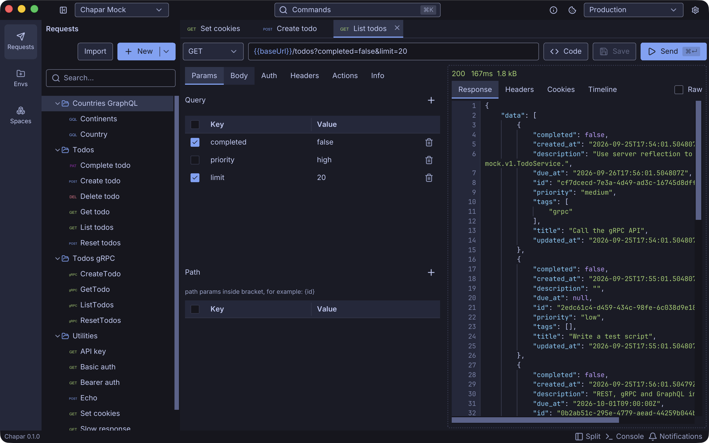
  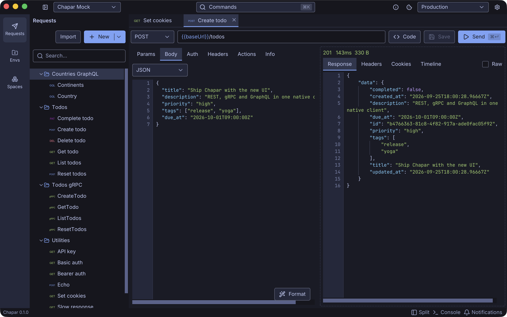
  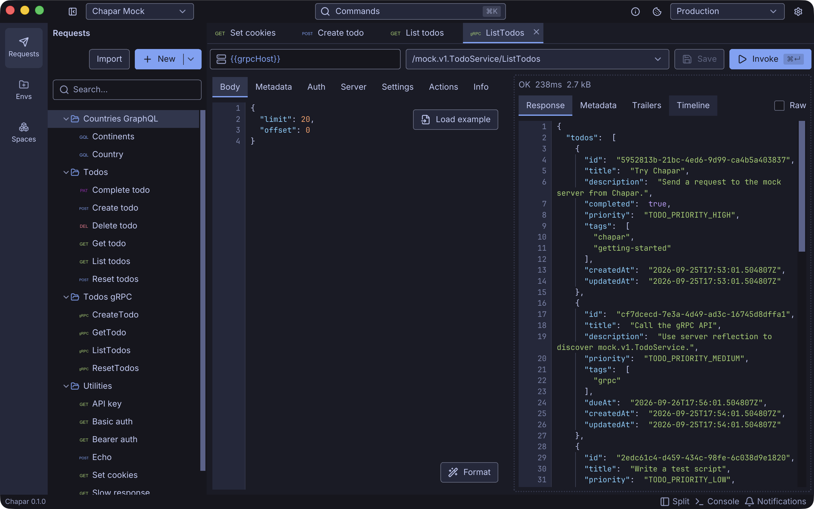
  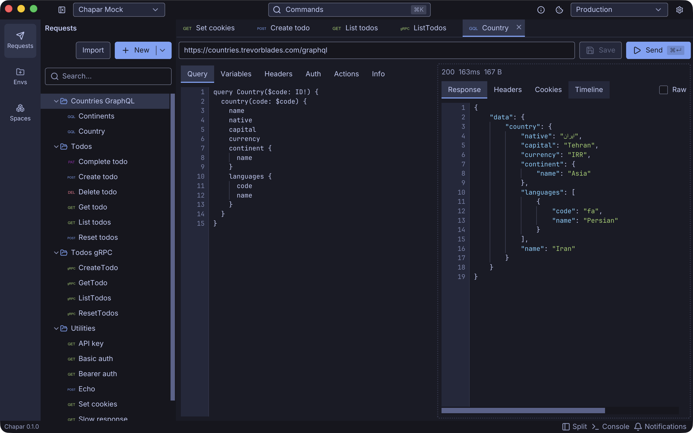
  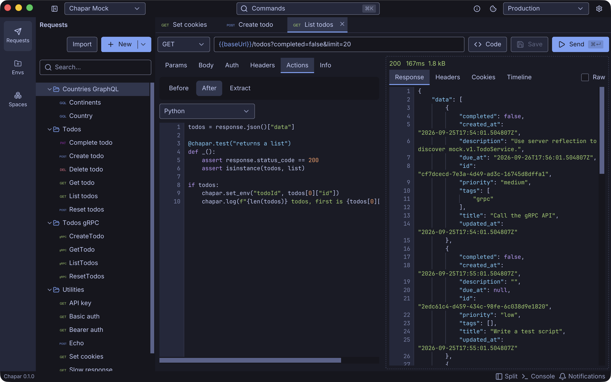
  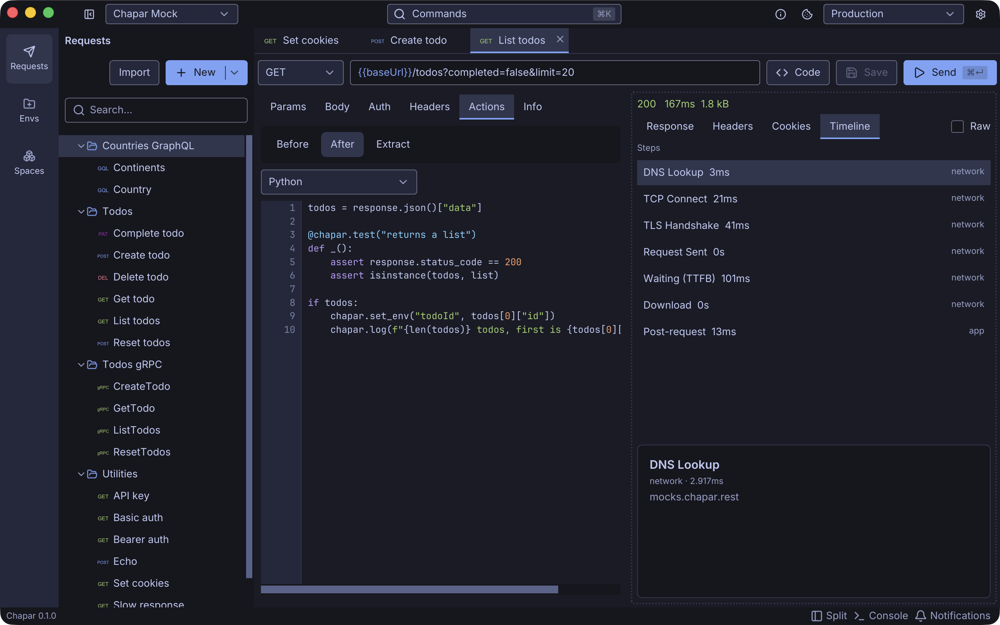
  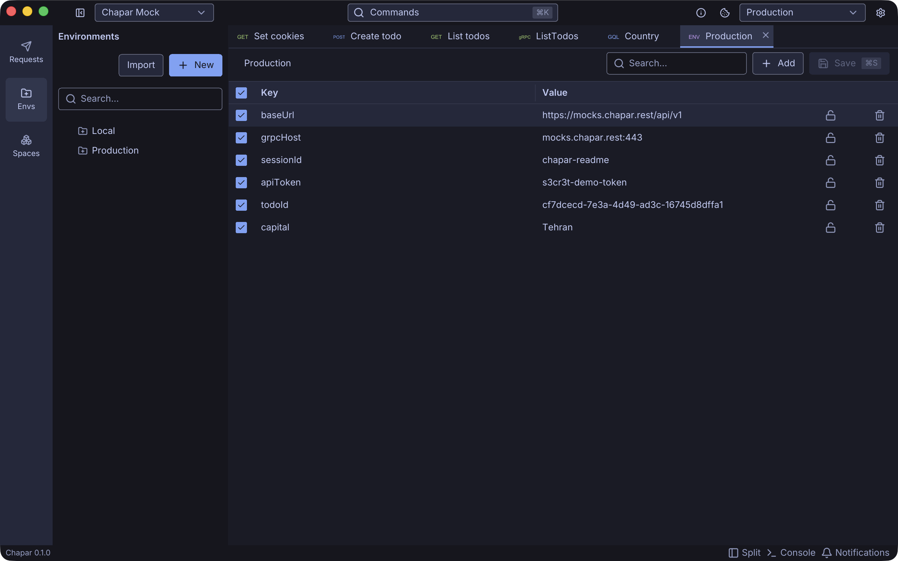
  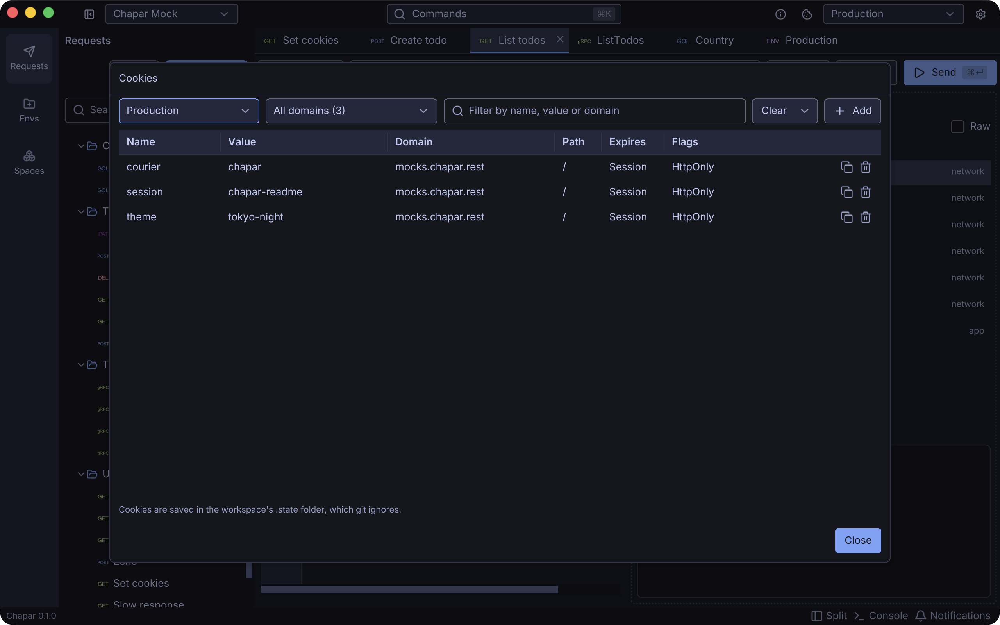
  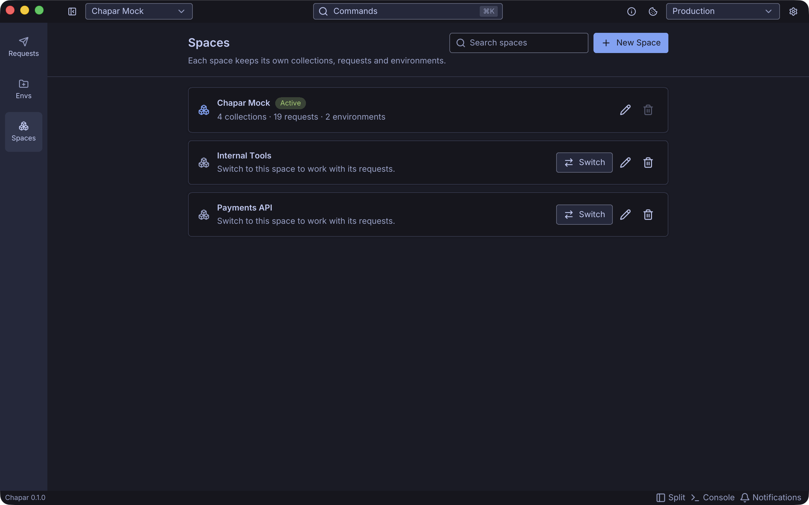
  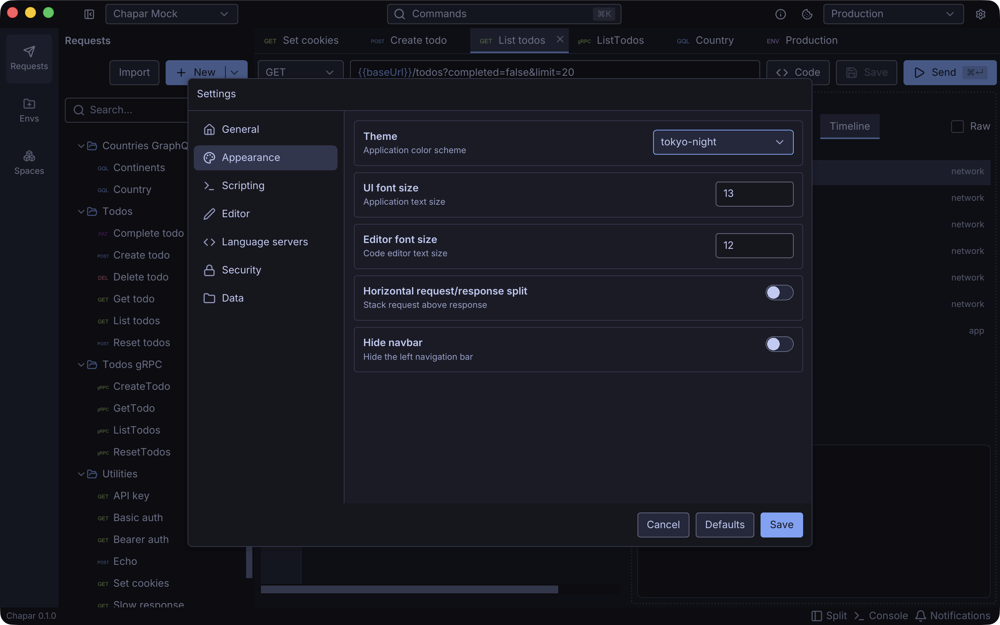
  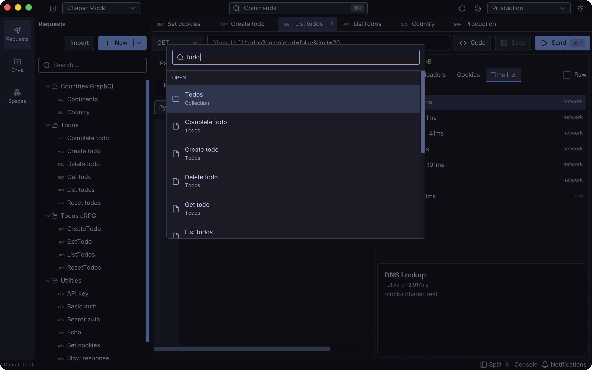
</div>

## Features

### Protocols
* **REST / HTTP**: every method, query and path params, JSON, XML, text, form-data, URL-encoded and binary bodies, with syntax highlighting and formatting.
* **gRPC**: server reflection or proto files, unary and server-streaming methods, metadata and trailers, TLS and client certificates, and a sample message for any method.
* **GraphQL**: queries and variables, with the response data and errors split out.

### Workflow
* **Workspaces** keep separate collections, requests and environments; switch between them from the title bar.
* **Collections** share headers, auth and notes with every request inside them.
* **Environments** hold variables you use as `{{name}}` anywhere in a request. Values you mark secret are encrypted with a key kept in the OS keychain.
* **Cookie jar** per environment: cookies from responses are stored and sent back automatically, and you can view, edit, add or clear them.
* **Auth**: Basic, Bearer token and API key, set per request or inherited from the collection.
* **Pre and post-request actions**: run another request first, extract values from the response body, headers or cookies into the environment, or write Python scripts with tests and logs.
* **Timeline** of every request: DNS, connect, TLS, time to first byte, scripts.
* **Code generation** for cURL, Python, Go, JavaScript (fetch, axios), Java and Kotlin (OkHttp), Ruby and .NET.
* **Import** Postman collections, OpenAPI specs and proto files.
* **Command palette** (`⌘K` / `Ctrl+K`) to open any request, collection or environment and run any command.

### Editor and app
* Code editors with language-server completion and diagnostics (Python out of the box; JSON, XML, Go, JavaScript and more in Settings).
* Themes, including Tokyo Night, Catppuccin, Dracula, Nord, Gruvbox, One, Solarized and GitHub.
* Side-by-side or stacked request/response layout, a console panel and a notification history.
* Everything is stored as YAML files, so a workspace can live in git.

### Roadmap
* WebSocket and MQTT support.
* Tunneling to servers and Kubernetes clusters as pre-request actions.

### Getting Started
To Get started with Chapar, you can download the latest release from the [releases page](https://github.com/chapar-rest/chapar/releases).
There you can find the latest release for your operating system.

#### Install on macOS
On macOS, you can install Chapar via Homebrew, download the latest release, or install from Apple's App Store.

**Homebrew (recommended)**
```bash
brew tap chapar-rest/chapar
brew install --cask chapar
```

To upgrade to the latest version:
```bash
brew upgrade --cask chapar
```

**App Store**

<a href="https://apps.apple.com/us/app/chapar-rest/id6673918597?mt=12&itscg=30200&itsct=apps_box_badge&mttnsubad=6673918597" style="display: inline-block;">

</a>
<br/><br/>
Note that the App Store version is running in a sandbox environment and if you are already using the downloaded
or custom build version, you need to copy your data to the sandbox environment. you can do it by running the following command:

```bash
cp -r $HOME/.config/chapar $HOME/Library/Containers/rest.chapar.app/Data/.config
```
or make a symlink to the sandbox environment:
```bash
ln -s $HOME/.config/chapar $HOME/Library/Containers/rest.chapar.app/Data/.config
```

#### Install From AUR
On Arch-based distros, you can install Chapar from the AUR using your favorite AUR helper:
```bash
yay -S chapar-bin
```
Please note that AUR package is maintained by a community contributor. (@Monirzadeh ) may not be up to date with the latest release.

#### Install From Source
To install Chapar from source, clone the repository install the dependencies, and run the application using the following commands:
```bash
git clone https://github.com/chapar-rest/chapar.git
cd chapar
go build -o chapar .
```

To build the same packages the releases ship (DMG, tar.xz, zip), install the [Yoga](https://github.com/mirzakhany/yoga) CLI with `make install_deps` (the version `go.mod` uses); `yoga.toml` holds the packaging config:
```bash
yoga package -os darwin -arch arm64 -version v0.7.0   # dist/darwin/*.dmg
yoga package -os linux -version v0.7.0                # dist/linux/*.tar.xz
yoga package -os windows -version v0.7.0              # dist/windows/*.zip
```

Dependencies are vendored. Update them with `make vendor`, not `go mod vendor`: the script also copies the tree-sitter C sources that `go mod vendor` leaves out.

## Dependencies
Chapar is built with [Yoga](https://github.com/mirzakhany/yoga), which renders through GLFW and WebGPU, so building needs CGO and a C compiler:

- macOS: Xcode Command Line Tools (`xcode-select --install`).
- Linux (Debian/Ubuntu): `sudo apt install gcc libx11-dev libxrandr-dev libxinerama-dev libxcursor-dev libxi-dev libxxf86vm-dev libgl1-mesa-dev`.
- Windows: a MinGW-w64 GCC on `PATH` (for example from [MSYS2](https://www.msys2.org/)).

Tests run headless with `go test -tags nogpu ./...`, which needs no window system.


### Contributing
Contributions are welcome! If you have ideas, feedback, or wish to contribute, please open an issue or submit a pull request.

### Support the Project
You can support the development of Chapar by starring the repository, sharing it with your friends, and contributing to the project.
Also you can support the project by donating to the project's wallet.

[](https://www.buymeacoffee.com/mohsen.mirzakhani)

#### Supporters
JetBrains generously granted me a year of their open-source support licenses to work on this project.
