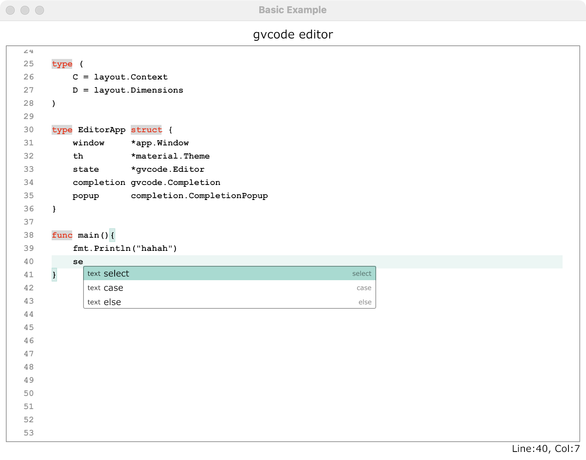

# gvcode

gvcode is a Gio based text editor component for code editing.

## Key Features:

- Uses a PieceTable backed text buffer for efficient text editing.  
- Optimized undo/redo operations with built-in support in the PieceTable.  
- Supports both hard and soft tabs, ensuring alignment with tab stops. 
- Lines can be unwrapped, with horizontal scrolling supported.  
- Syntax highlighting is available by applying text styles.  
- Built-in line numbers for better readability.  
- Auto-complete of bracket pairs and quote pairs.
- Auto-indent new lines.
- Bracket auto-indent.
- Increase or descease indents of multi-lines using Tab key and Shift+Tab.
- Expanded shortcuts support via command registry.
- Flexible auto-completion via the Completion API, a built-in implementation is provided as an Add-On.
- Large file rendering(Planned).

## Why another code editor?

I ported Gio's editor component to [gioview](https://github.com/oligo/gioview) and added a few features to support basic code editing, but it is far from a good code editor. Keep expanding the original editor seems a wise decision, but the design of the original editor makes it hard to adding more features. And it is also not performant enough for large file editing/rendering. Most importantly it lacks tab/tab stop support. When I tried to add tab stop support to it, I found it needs a new overall design, so there is gvcode.

## Key Design

Gio's text shaper layout the whole document in one pass, although internally the document is processed by paragraphs. After the shaping flow, there is a iterator style API to get the shaped glyphs one by one. This is what Gio's editor does when layouting the texts. 

Gvcode has chosen another way. gvcode read and layout in a paragraph by paragrah manner. The outcomes are joined together to assemble the final document view. This gives up the oppertunity to process the text only visible in the viewport, making incremental shaping possible. Besides that we can also process tab expanding & tab stops at line level, because we have full control of the paragraph layout. To achive that goal, gvcode implemented its own line wrapper.


## Screenshots


## How To Use

Gvcode exports simple APIs to ease the integration with your project. Here is a basic example:

```go
    state := &editor.Editor{}
    var ops op.Ops

    for {
        e := ed.window.Event()

        switch e := e.(type) {
        case app.DestroyEvent:
            return e.Err
        case app.FrameEvent:
            gtx := app.NewContext(&ops, e)
            
            es := gvcode.NewEditor(th, state)
            es.Font.Typeface = "monospace"
            es.TextSize = unit.Sp(12)
            es.LineHeightScale = 1.5
            es.Layout(gtx)

            e.Frame(gtx.Ops)
        }
    }
```

For a full working example, please see code in the folder `./example`.

### Configuration

`gvcode` uses `EditorOption` to configure the various part of the editor. Here's how you can do that:

```go
    editor := &Editor{}
    editor.WithOptions(
        gvcode.WithSoftTab(true),
        gvcode.WithQuotePairs(quotePairs),
        gvcode.WithBracketPairs(bracketPairs),
        gvcode.WithAutoCompletion(completion),
    )
```

Some of the configurable properties might be missing from the `EditorOption` APIs, in this case you can set it directly to the editor.
Besides that, a `EditorStyle` object is provided to easy the initial setup.

Some of the notable options are illustrated below.

- `WithWordSeperators`: This is an optional configuration that set the word seperators. `gvcode` uses common word seperators as default value if there is no custom seperators. Please be aware that unicode whitespaces are always accounted, so there is no need to add them.
- `WithQuotePairs`: This configures the characters treated as quotes. Configured quote characters can be auto-completed if the left character is typed. This option is also optional if there is no extra requirements. 
- `WithBracketPairs`: This configures the characters treated as brackets. Configured brackets characters can be auto-completed if the left character is typed. This option is also optional if there is no extra requirements. 
- `WrapLine`: This configuration affects how the lines of text are layouted. If setting to true, a line of text will be broken into multiple visual lines when reaching the maximum width of the editor. If it is disabled, the editor make the text scrollable in the horizontal direction.
- `WithAutoCompletion`: This configures the auto-completion component. Details are illustrated in the section below.
- `AddBeforePasteHook`: This configres a hook to transform the text before pasting text.

#### Hooks

Hooks are used to intercept various operations and apply custom logic to the data. There is only one hook at this time.

- `BeforePasteHook`:  Transform the text before pasting text.

#### Command

Commands are specific key bindings and their handlers when the keys are pressed. They can be used extend the functionality of the editor. Please note that built-in key bindings are not yet open to customize.

Here is how to use it to add a custom key binding.

```go
    // register a command.
    editor.RegisterCommand(tag, key.Filter{Name: key.NameUpArrow, Optional: key.ModShift},
        func(gtx layout.Context, evt key.Event) gvcode.EditorEvent {
            // do something with the event.
            return nil
        },
    )

    // commands can also be removed at runtime
    editor.RemoveCommands(tag)
```

Commands are managed by groups, and you have to provide a tag (usually a pointer to the widget) when registering. The tag indicates the owner of the commands. If a key is already registered, the newly added one will "replace" the old one, and keyboard events are only delivered to the newly registered command handler until it is removed.

In the case of a overlay widget, this enables us to handle keyboard events without loosing focus of the editor. This is how the completion popup works behind the scene.


#### Auto-Completion

`gvcode` provides extensible auto-completion component. The central component is the `Completion` interface which acts as the scheduler between the editor and the completion algorithm, and the popup widget.

To setup an auto-completion component, we have to provide the following parts:
1. `Trigger`: Tell the editor in what condition can it activate the completion. An activated completion shows a popup box. 
    * `Characters`: This activates the completion if the user typed the required characters.
    * `KeyTrigger`: This activates the competion if the required key binding is pressed.
    * Other: This activates the completion if when any of the allowed characters are typed.

2. `Completor`: Completors provide completion algorithms to the completion component. The completion component accepts multiple completors so you can have different completors for different sources.
3. `CompletionPopup`: A `CompletionPopup` shows completion candidates to the user, and user can navigate through them to select the desired one.
4  `Completion`: The completion component itself.

The code from the example editor shows the usage:

```go
	// Setting up auto-completion.
	cm := &completion.DefaultCompletion{Editor: editorApp.state}

	// set popup widget to let user navigate the candidates.
	popup := completion.NewCompletionPopup(editorApp.state, cm)
	popup.Theme = th
	popup.TextSize = unit.Sp(12)

	cm.AddCompletor(&goCompletor{editor: editorApp.state}, popup)
```


## Cautions

`gvcode` is not intended to be a drop-in replacement for the official Editor widget as it dropped some features such as single line mode, truncator and max lines limit. 

This project is a work in progress, and the APIs may change as development continues. Please use it at your own risk.


## Contributing

See the [contribution guide](CONTRIBUTING.md) for details.


## Acknowledgments

This project uses code from the [Gio](https://gioui.org/) project, which is licensed under the Unlicense OR MIT License.

